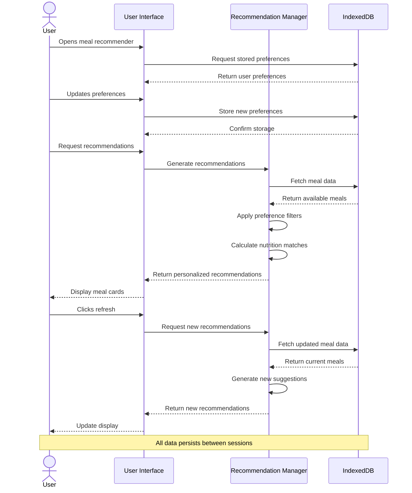

# Meal Recommender Feature Sequence Diagram

## Feature Description
The Meal Recommender is a sophisticated system that provides personalized dining suggestions to UMass students based on their dietary preferences and nutritional goals. The system integrates with IndexedDB for data persistence and provides real-time updates based on user interactions.

## Sequence Diagram

This sequence diagram illustrates the key interactions between the user, interface, recommendation system, and database, showing how the feature handles both initial loading and user interactions.