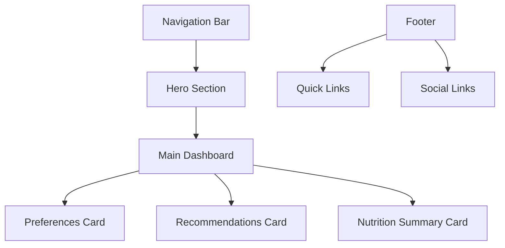

# Meal Recommender UI Components

## Main Layout

## Component Hierarchy
- Navigation Bar
  - Logo
  - Menu Links
- Hero Section
  - Title
  - Description
- Dashboard Grid
  - Preferences Section
    - Calorie Goal Input
    - Dietary Restriction Toggles
  - Recommendations Section
    - Meal Cards
    - Refresh Button
  - Nutrition Summary
    - Progress Bars
    - Stats Display
- Footer
  - Quick Links
  - Social Media Links

## User Interface Flow
1. User enters through main page
2. Sets preferences in the preferences card
3. Views recommended meals in the center section
4. Can refresh recommendations as needed
5. Tracks nutrition progress in summary card